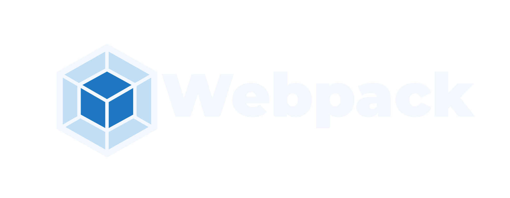

# Rebrand Draft

Before deep-diving in the rebranding we need to define why we are doing it and what we want to achieve.

## Why rebrand?

Mostly because we want to refresh the website and for that we need a good design system. And actually the "branding" page on https://www.webpack.js.org/branding/ is not solid enough to be used as a reference.

## Goals

- New colors
- Updated logo
- New design system (typography, buttons, forms, etc.)
- Consistent look and feel across the website and documentation
- Ressources for commincation (social media, presentations, etc.)

## Naming Convention

Webpack can should be written as "Webpack" or "webpack" depending on the context. The "W" is capitalized when it is at the beginning of a sentence or in titles. In other cases, it can be written in lowercase.

"light theme" define an assets that is designed to be used on light backgrounds, while "dark theme" is designed for dark backgrounds.

## Color Palette

| Color      | Value     |
|------------|-----------|
| `blue-50`  | `#F2F8FD` |
| `blue-100` | `#E4EFFA` |
| `blue-200` | `#C2DEF5` |
| `blue-300` | `#8DC3EC` |
| `blue-400` | `#50A5E0` |
| `blue-500` | `#298ACE` |
| `blue-600` | `#1D78C1` |
| `blue-700` | `#16568E` |
| `blue-800` | `#174A75` |
| `blue-900` | `#183F62` |
| `blue-950` | `#102841` |
| `gray-50`  | `#F8FAFC` |
| `gray-100` | `#F8FAFC` |
| `gray-200` | `#E2E8F0` |
| `gray-300` | `#CAD5E2` |
| `gray-400` | `#90A1B9` |
| `gray-500` | `#62748E` |
| `gray-600` | `#45556C` |
| `gray-700` | `#314158` |
| `gray-800` | `#1D293D` |
| `gray-900` | `#0F172B` |
| `gray-950` | `#020618` |
| `white`    | `#FFFFFF` |
| `black`    | `#000000` |

## Logo

The deeper blue on logo is `blue-700` and the lighter blue is `blue-300`.

### For light backgrounds

The text color is `blue-950`.

### For dark backgrounds

The text color is `blue-50`.

## Typography

### Font Family

We decide to use [Montserrat](https://fonts.google.com/specimen/Montserrat) for headings and logo text and [Open Sans](https://fonts.google.com/specimen/Open+Sans) for body text.
